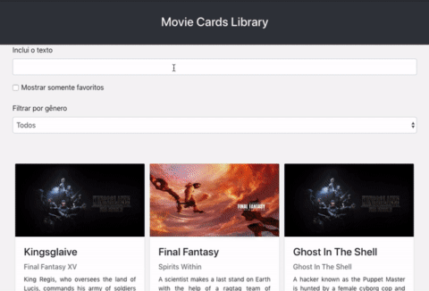

<figure>
  
  <figcaption>Gif retirado repositório das instruções do projeto</figcaption>
</figure>

# Movie Cards Library Stateful

Projeto feito de forma individual durante o curso da [Trybe](https://www.betrybe.com/) com o objetivo de utilizar componentes React para construir uma aplicação de gerenciamento de filmes.

## ⭐ Habilidades

- Utilizar as habilidades de React para a criação de componentes de classe e com de estados.
- Utilizar o framework Bootstrap para realizar estilizações.

## 🔧 Funçoes

- Criar cards de filmes
- Filtrar filmes por categoria, genero, título e sinopse.

## 💻 Como iniciar

1. Faça o clone do projeto
2. Instale as dependências
```shell
npm install
```
3. Inicialize a aplicação
```shell
npm start
```

## Feito Com:
[](https://code.visualstudio.com/)
[](https://developer.mozilla.org/pt-BR/docs/Web/React)
[](https://developer.mozilla.org/pt-BR/docs/Web/JavaScript)
[](https://developer.mozilla.org/pt-BR/docs/Web/CSS)
[](https://developer.mozilla.org/pt-BR/docs/Web/JavaScript)


### Contato

[](https://www.linkedin.com/in/michaelcaxias/)

<p align="center">Copyright © 2021 Michael Caxias</p>
